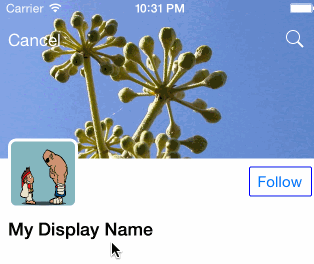
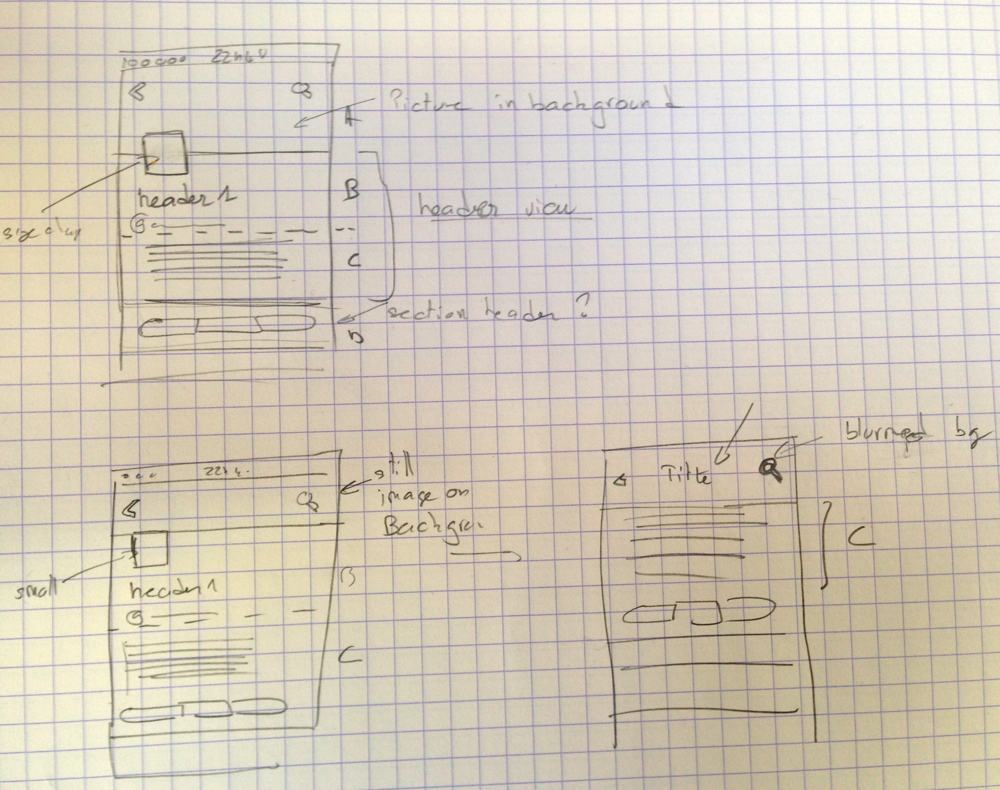
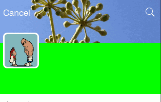
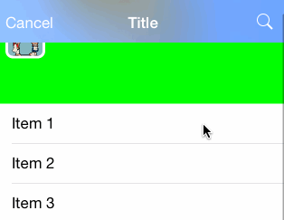
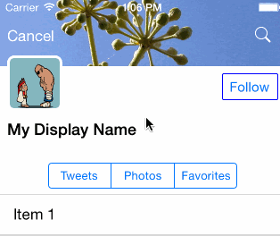

# Mimic Twitter Profile UI

This project is an attempt to mimic the twitter profile page UI (version 6.x).

The goal is not to do it exactly like it's done in the Twitter application, actually i don't know how they done it.
It's just an attempt to achieve similar effect.

Let me explain some key points here.

## Effect Overview

There are 3 key steps in the header animation.

* ExpandedState

At the begining there is a top picture (banner) on top of the table view. This picture is going under the navbar to the top of the view.
If you scroll up, then the image will stretch (zoom to fill).

* Minified State

If you scroll down, all the header is moving up, and the avatar on the left is shrinking to it's minimal size. This until the bottom of the profile banner as reach the bottom on the navbar.

* Blur and title arrival animation

Then from this point the banner picture will start to blur, and become like a navbar background.
The nav title will slowly appear (moving from bottom to top)
And now the avatar image will move up *under* the banner picture (it was upon before)

After this quick look at the effect, i decided to implement the banner, info and avatar views as a tableview header. The segmented control as a simple section header.

## Implementation notes

### Banner Picture animation

I started first by creating the table view and setting it as full screen. I just put the image in the table header view (no avatar, display name, handle...).
The key points here are to use autolayout constraint to achieve the zoom to fill effect when you scroll up, and also to force the banner to stay under the nav bar.

I used the following constraints for that (stick the image top to the top, and set minimal height):

    // ===== Header image view should not be smaller than nav bar and stay below navbar ========
    
    format = @"V:[headerImageView(>=minHeaderHeight)]-(subHeaderHeight@750)-|";
    constraints = [NSLayoutConstraint constraintsWithVisualFormat:format options:0 metrics:metrics views:views];
    [self.view addConstraints:constraints];
    
    format = @"V:|-(headerHeight)-[subHeaderPart(subHeaderHeight)]";
    constraints = [NSLayoutConstraint constraintsWithVisualFormat:format options:0 metrics:metrics views:views];
    [self.view addConstraints:constraints];

    // ===== Header image view should stick to top of the 'screen'  ========

    NSLayoutConstraint* magicConstraint = [NSLayoutConstraint constraintWithItem:headerImageView attribute:NSLayoutAttributeTop relatedBy:NSLayoutRelationEqual toItem:self.view attribute:NSLayoutAttributeTop multiplier:1.0f constant:0.0];
    [self.view addConstraint: magicConstraint];

The nav bar is setup as completly transparent, and i use the scroll events to detect when the header is reaching the step 2:

    - (void) scrollViewDidScroll:(UIScrollView *)scrollView
    {
        CGFloat yPos = scrollView.contentOffset.y;
        if (yPos > _headerSwitchOffset && !_barIsCollapsed) {
            [self switchToMinifiedHeader];
            _barIsCollapsed = true;
        } else if (yPos < _headerSwitchOffset && _barIsCollapsed) {
            [self switchToExpandedHeader];
            _barIsCollapsed = false;
        }
        ...
    }

For this first step the header title apparition was not yet animated.
The simple blur effect is applyed when the header is 'minimized':

    - (void)switchToMinifiedHeader
    {
        UIBlurEffect *blurEffect = [UIBlurEffect effectWithStyle:UIBlurEffectStyleLight];
        UIVisualEffectView *visualEffectView = [[UIVisualEffectView alloc] initWithEffect:blurEffect];
        visualEffectView.frame = self.imageHeaderView.bounds;
        self.visualEffectView = visualEffectView;
        [self.imageHeaderView addSubview:visualEffectView];
        ...
    }

### Avatar Picture animation

Then I started with the animation of the avatar image. This image must shrink to a minimal size, and then continue to move up.
This effect was achieved by adding several constraints and by playing with their priority.

The first two constraints are straight forward:

    // ===== avatar should stick to left with default margin spacing  ========
    format = @"|-[avatarImageView]";
    ...
    
    // === avatar is square
    ...

Now, the bottom of the avatar image is first attached to the bottom of the table header view with a priority of 801.
And the there is an opposite constraint to the top, saying that the top of the image must be lower than the bottom of the navbar with a priority of 790.

Notice that at the beginning there is no conflict between the 2 constraints, but if you scroll down to much and the avatar image reach the bottom of the navbar, the second constraint will break (lower priority), and then the avatar will continue to go up.

Then i added two size constraints to the image.

A first one to set the image maximum (and default) size, with a priority of 760 (to be more than the default intrinsic size that is priority 750) otherwise the imageView size will be the image size (too big in my case).

And another one to set the minimal size with a priority of 800. As you can see this constraint priority is greater than the constraint attaching the image top to the bottom of the navbar, meaning that when the image will be that small, the constraint to the bottom of the navbar will break, and the image will continue to scroll up.

    // ===== avatar size can be between avatarSize and avatarCompressedSize
    format = @"V:[avatarImageView(<=avatarSize@760,>=avatarCompressedSize@800)]";

Here there is an issue when the avatar starts to scroll to the up again, it's going upon the navbar instead of below, this was fixed by swtiching the view order:

    - (void)switchToMinifiedHeader
    {
         ....
        //Inverse Z-Order of avatar Image view
        [self.tableView.tableHeaderView exchangeSubviewAtIndex:1 withSubviewAtIndex:2];
    }

### Title View animation

I implemented this by setting a custom title view to the existing navbar. I am not sure if it's the way to go though.
In order to animate the view position i had to use the _setTitleVerticalPositionAdjustment_, it cannot be done with transform or by moving the frame origin. I also had to configure the navbar to clip the content. All of this will probably have some side effects if you push some controllers on the current navigation controller.
This code is in the view didScroll method (forgive me for the magic numbers).

    - (void) scrollViewDidScroll:(UIScrollView *)scrollView
    {
        CGFloat yPos = scrollView.contentOffset.y;
    
  	 	if(yPos > _headerSwitchOffset +20 && yPos <= _headerSwitchOffset +20 +40){
 	       CGFloat delta = (40 +20 - (yPos-_headerSwitchOffset));
 	       [self.navigationController.navigationBar setTitleVerticalPositionAdjustment:delta forBarMetrics:UIBarMetricsDefault];      
    	}
    ...
    }

### Blur effect animation

I don't really know what's the best way to do this effect. After a quick research i decided to use the ImageEffects category that i have found here:

https://github.com/iGriever/TWSReleaseNotesView

I read about it in this article:

http://code.tutsplus.com/tutorials/adding-blur-effects-on-ios--cms-21488

Thanks to this new category, i have the following method:

    	- (UIImage *)applyBlurWithRadius:(CGFloat)blurRadius tintColor:(UIColor *)tintColor saturationDeltaFactor:(CGFloat)saturationDeltaFactor maskImage:(UIImage *)maskImage

 I first tried to call directly this method in the _scrollViewDidScroll_ method, but of course it was freezing the UI.
 So i decided to use a cache of the computed blurred images, and then to just use the one in cache.
 I used 10 'discret' steps for the blurred animation:

# Credits

Avatar picture:
http://cheesyniblets.deviantart.com/art/ryu-and-sagat-15663243

Blur effect:

http://code.tutsplus.com/tutorials/adding-blur-effects-on-ios--cms-21488

https://github.com/iGriever/TWSReleaseNotesView

